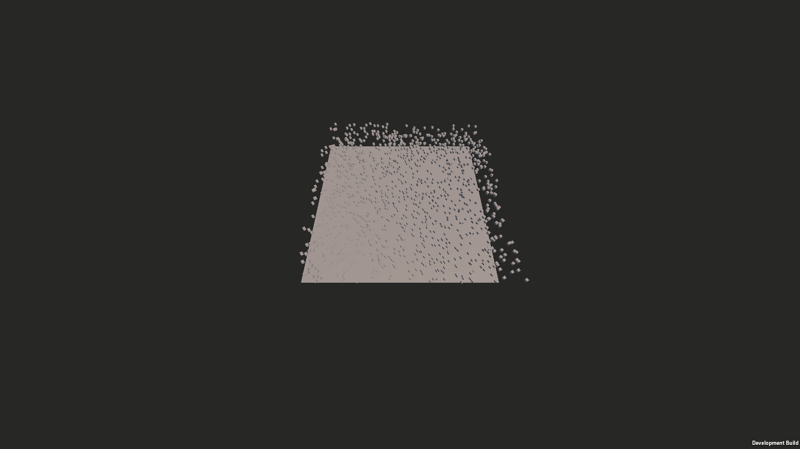

# Unity Network Benchmark

Benchmarks several game-engine / networking-library combinations against the
same synthetic workload — spawn N objects, progressively make them move,
record events and profiler metrics — so results are comparable. Each
combination is its own standalone Unity or Godot project; a Python pipeline
turns the exported CSVs into statistics and plots.

🎥 [Demo video — networked run (client + server)](docs/figs/video-app-benchmark-online-client&server.mp4)

📚 **Full documentation, including C4 architecture diagrams: [`docs/`](docs/README.md).**
Implementation-level detail (config flags, CSV schema, build/run commands):
[`docs/reference.md`](docs/reference.md).

## Repo layout

| Path | What |
|---|---|
| `com.imt-atlantique.benchmark-base/` | Shared Unity package (benchmark flow, CSV/profiler export) used by every Unity variant |
| `base/`, `base_GPU/`, `base_DOTS/` | Unity baseline variants (no networking) |
| `ngo/`, `fishNet/`, `photonFusion/`, `NetcodeEntities/` | Unity variants, one per networking library |
| `Godot_Benchmark/`, `Godot_Network_Benchmark/` | Godot baseline + networked variants |
| `data-analysis/` | Python pipeline: interactive dashboard (`streamlit/`) + statistical reports (`ccl/`) |
| `builds/` | Consolidated build outputs |

## Quick start for development

1. **Pick a variant** from the table above and open it in Unity Hub
   (Unity 6000.3.7f1, see `build_all_versions.ps1`) or the Godot editor.
   Every Unity variant is a normal Unity project that pulls in
   `com.imt-atlantique.benchmark-base` as a local package dependency — edit
   the package once and every variant that uses it picks up the change.
2. **Run it** from the editor, or build it (`.\build_all_versions.ps1` builds
   all Unity variants for PC + Android). NGO has a ready-made local
   server+client runner: `.\ngo\Assets\Runners\run-ngo-benchmark.ps1`.
3. **Check the output**: CSVs land under `Application.persistentDataPath`
   (see [`docs/reference.md`](docs/reference.md#runtime-outputs) for the
   schema).
4. **Analyze results**: put the exported CSVs under `data-analysis/data/`,
   then `streamlit run data-analysis/streamlit/app.py` for interactive
   exploration, or run the `data-analysis/ccl/` scripts for statistical
   reports. See [`docs/reference.md#data-analysis-workflow`](docs/reference.md#data-analysis-workflow).

## Contributing

Full guide (prerequisites, adding a new variant end-to-end, running the test
suites): [`docs/contributing.md`](docs/contributing.md). Short version:

- **Changing shared benchmark logic** (spawn/move flow, CSV export): edit
  `com.imt-atlantique.benchmark-base/Runtime/Scripts/` — it's the single
  source of truth for every Unity variant, so a change there doesn't need to
  be repeated per project. Not every variant uses it identically, though —
  see [the component diagram](docs/architecture/c4-component-benchmark-base.md)
  for which variants override vs. bypass which parts.
- **Adding a new networking library / engine variant**: clone the closest
  existing project as a starting point (e.g. `fishNet/` for a new Unity
  netcode library), wire it to `com.imt-atlantique.benchmark-base`, and
  register it with the analysis side by following
  [`ccl/README.md`'s "Adding a new benchmark type"](docs/data-analysis/ccl/README.md#adding-a-new-benchmark-type)
  checklist — skipping it means the new variant's data gets silently
  dropped from reports rather than erroring.
- **Working on the analysis pipeline**: `streamlit/` and `ccl/` both have
  real test suites (`python -m unittest discover -s tests -v` in each);
  run them before sending changes to shared modules
  (`data_loader.py`, `metrics_engine.py`).
- Documentation history (what was missing, how it was addressed) is in
  [`docs/architecture/README.md`'s "Documentation pass" section](docs/architecture/README.md#documentation-pass-2026-08-25).
