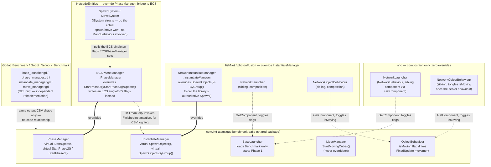

# C4 — Components: `com.imt-atlantique.benchmark-base`

One level down from the [container diagram](c4-container.md), scoped to a
single container: how the shared Unity package's classes work, and how
each variant actually extends or bypasses them. This is the "why can I
trust that every variant runs the *same* benchmark logic" question from
[ADR 0002](decisions/0002-shared-benchmark-base-package.md), answered at
the code level.

Verified against the actual `.cs` files, not assumed from naming — the four
variants use four genuinely different strategies, not one consistent
pattern.

## The four supersession strategies

1. **`ngo/` — no override at all.** `InstantiateManager`, `PhaseManager`,
   `MoveManager` run completely unmodified. `NetworkLauncher` and
   `NetworkObjectBehaviour` are separate `NetworkBehaviour` components
   placed on the same GameObjects, found via `GetComponent<BaseLauncher>()`
   / `GetComponent<ObjectBehaviour>()`, and they toggle flags
   (`startAutoPhase1`, `isMoving`) rather than replacing any logic. NGO's
   own `NetworkObject.Spawn()` is called from `NetworkObjectBehaviour.Start()`
   *after* the shared `InstantiateManager` has already instantiated the
   GameObject locally.
2. **`fishNet/` and `photonFusion/` — subclass `InstantiateManager`.**
   `NetworkInstantiateManager : InstantiateManager` overrides the two
   `protected virtual` spawn coroutines to call the library's authoritative
   spawn API (`InstanceFinder.ServerManager.Spawn(go)` for FishNet,
   `_runner.Spawn(...)` for Photon Fusion) instead of a plain `Instantiate()`
   — everything else in the coroutine (timing, wave logic, the
   `StartingInstantiation`/`FinishedInstantiation` events) is inherited
   unchanged. Launcher and per-object movement gating still use the
   composition pattern from #1.
3. **`NetcodeEntities/` — subclass `PhaseManager`, bridge to ECS.**
   `ECSPhaseManager : PhaseManager` overrides `StartPhase2()`/`StartPhase3()`/
   `Update()` to flip flags on an ECS singleton (`BenchmarkConfig`) instead
   of driving `InstantiateManager`/`MoveManager` directly. The actual
   spawning and movement happen in `SpawnSystem`/`MoveSystem`
   (`ISystem` structs, Unity DOTS) that poll that singleton every frame —
   `InstantiateManager`/`MoveManager` are still present in the scene but
   their spawn/move mechanics are bypassed entirely. `ECSPhaseManager`
   manually re-invokes `InstantiateManager.Instance.FinishedInstantiation`
   so the shared CSV/event logging pipeline keeps working even though
   `InstantiateManager` isn't the thing actually spawning objects anymore.
4. **Godot variants — no code relationship.** Different engine and
   language; `Godot_Benchmark`/`Godot_Network_Benchmark` reimplement the
   same phase/spawn/move flow independently in GDScript (see
   [reference.md](../reference.md#running-each-variant-locally)). They're
   compatible with the rest of the suite only because their output CSVs
   follow the same shape and the run-folder naming convention
   `classify_subsystem()` expects — see
   [`ccl/README.md`](../data-analysis/ccl/README.md#adding-a-new-benchmark-type).

## Why this matters

[ADR 0002](decisions/0002-shared-benchmark-base-package.md) argues that a
shared package is what makes cross-variant comparisons trustworthy — but
that claim is only as strong as what's *actually* shared. In practice:
timing, wave logic, and event emission for spawning are shared verbatim by
three of five Unity variants (`ngo` untouched, `fishNet`/`photonFusion`
overriding only the Spawn call); `NetcodeEntities` shares only the
*bootstrapping and logging shell*, not the spawn/move mechanics themselves,
which is a materially different level of code reuse than the other three —
worth knowing before treating a NetcodeEntities result as "the same
benchmark, different backend" in the same breath as the others.
