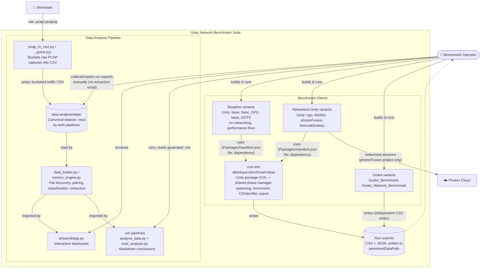

# C4 — Container Diagram

One level down from the [system context](c4-context.md): the containers
inside the suite and how they exchange data. "Container" here means a
separately buildable/runnable unit (a Unity/Godot project, a shared package,
a script or app) — not a Docker container.

Drawn as a plain Mermaid flowchart rather than `C4Container` for the same
reason as the [context diagram](c4-context.md) — Mermaid's C4 renderer
doesn't lay out this many nodes/relationships without overlapping labels.

## Reading notes

- **No extraction script exists anymore** (an older `extract_data.py` is
  superseded, see [reference.md#data-analysis-workflow](../reference.md#data-analysis-workflow)) —
  the operator collects/copies run exports into `data-analysis/data/`
  themselves. The dashed `exports -.-> operator` arrow stands in for that
  manual step (opening/copying files), not an automated one.
- `com.imt-atlantique.benchmark-base` is the one container every Unity
  variant shares — see [reference.md](../reference.md) for
  its internal three-layer split (`base.model` / `base.core` /
  `base.profiling`), which is deliberately left out of this diagram (that's
  a component-level concern, not a container-level one).
- `data_loader.py` / `metrics_engine.py` are drawn once because both
  `streamlit/` and `ccl/` import them directly (`ccl/` does
  `sys.path.append(.../streamlit)`) rather than each having its own copy —
  see [`ccl/README.md`](../data-analysis/ccl/README.md) for why, and for
  how to extend classification/metrics so both consumers pick it up.
- Godot variants write CSVs independently of the Unity `benchmark-base`
  package (different engine, no shared code) — they're compatible only
  because they follow the same output shape and naming convention that
  `classify_subsystem()` relies on.
