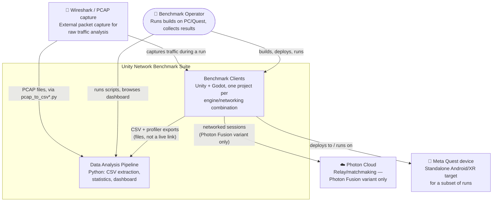

# C4 — System Context

Who/what interacts with the benchmark suite as a whole. See the
[architecture overview](README.md) for the accompanying prose and the
[container diagram](c4-container.md) for the next level down.

Drawn as a plain Mermaid flowchart rather than `C4Context` — Mermaid's
built-in C4 renderer lays out relationship labels poorly on anything but
the simplest diagrams (overlapping text, illegible boundary titles); a
flowchart with the same C4 read (person / internal system boundary /
external system) renders reliably instead.

## Notes

- The suite has no live/online components: clients write local files, the
  operator moves them into `data-analysis/data/`, and analysis runs offline.
  The `clients` → `analysis` arrow is "produces files consumed by," not a
  runtime dependency.
- Photon Cloud is the only external network service in scope; all other
  networking libraries (NGO, FishNet, NetcodeEntities, Godot's multiplayer)
  run peer-to-peer/local-server without an external dependency.
